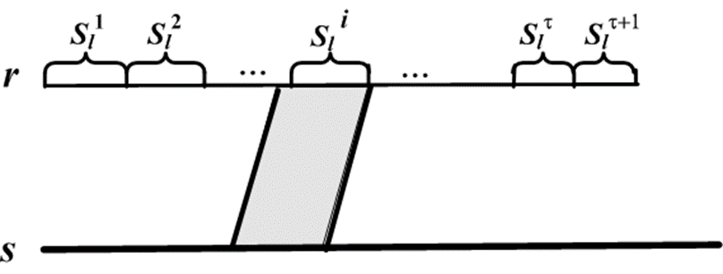
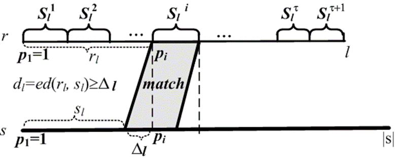
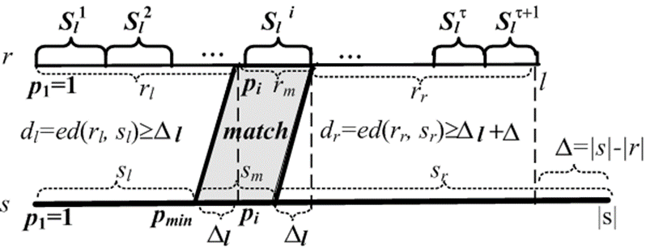
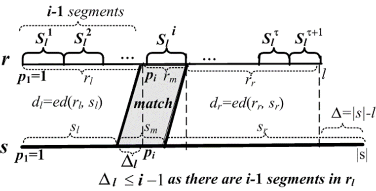

# Derivation of PassJoin in Bottom-K
## Description
The derivation of this project is based on the passjoin for edit-distance, and improved to the bottom-k.
Before deriving the formula and cases, let's review the definition of bottom-k

### Bottom-k Similarity Definition

Bottom-k sampling refers to the process of picking a sample **Sk(X)** consisting of the **k** elements that are smallest according to a given hash function **h**.

A standard application of bottom-k sampling is the estimation of the Jaccard similarity between sets **A** and **B**:

1. The bottom-k samples from **A** and **B** are constructed.
2. The bottom-k sample of their union is formed as 
2. The bottom-k sample of their union is formed as $$ S_k(A ∪ B) = S_k(S_k(A) ∪ S_k(B)). $$
3. The similarity is estimated as $$ \frac{{|S_k(A \cup B) \cap S_k(A) \cap S_k(B)|}}{k}. $$

### Formula

Given:

- **A** and **B**: Sets being compared
- **k**: Number of elements to consider as the sample

The bottom-k similarity can be estimated using the following formula:
$$
    f = |S_k(A ∪ B) ∩ S_k(A) ∩ S_k(B)| / k
$$
where **Sk(X)** is the bottom-k sample of **X**, and **f** is the estimated similarity between **A** and **B**.

Edit Distance Bound: 
$$
    \text{ed}(X,Y) \leq |X \Delta Y| \leq 2*(1 - \delta)|X|
$$

Todo:
We only think about to make sure the LCS should be over **δk**, but not involve the case that it should be in the **Sk(A ∪ B)**. If we consider that constraint, will the bound of edit distance change?

## Derivation
There are two main points when estimating jaccard similarity given two bottom-k of the same length

1. Find their overlap; the length of LCS should be larger than **k*δ** (the similarity threshold).
2. The LCS that **∩ Sk(A ∪ B)** should be larger than **k*δ**.

If two bottom **k** have different lengths, shrink the longer one to the same length of the other when comparing them.

### Partition Schema
Split **r** to **τ +1** disjoint segments, **τ = 2*(1-δ)*k** (**τ** is the maximal available edit distance).

To find: Is there any substring of s matching a segment of r ?

### Shift-aware Method
We only need to think about the case that **s** is longer than **r**, cause we can control for current **s** we only compare it to the shorter **r**. Also, due to the definition of bottom-k, if two bottom of different lengths, we omit the **Δ** (the extra part in **s**).

Pruning Condition:
$$ ||s_l|-|r_l|| > τ $$

For each segment ri with the start position Pi , only compare to the substrings with start position in                                    
$$ [P_i - |τ| , P_i + |τ|], τ = 2*(1-δ)*k, k = |r| $$

### Position-aware Method
Pruning Condition:
$$ ||s_l|-|r_l|| + ||s_l|-|r_l||> τ $$

For each segment ri with the start position Pi , only compare to the substrings with start position in                                    
$$ [P_i - |τ/2| , P_i + |τ/2|], τ = 2*(1-δ)*k, k = |r|  $$

In this method, we cannot apply more pruning conditions based on "LCS that **∩ Sk(A ∪ B)** should be larger than **k*δ**." Because thinking about the best case, the LCS is always at the frontest part in **r** and **s**, except **Δ**, the pruning filter cannot be more powerful than the condition proposed before.

### Multi-match-aware Method -- Left-side Perspective
Observation: If none of the enough unvisited segments having matching substring in **s**, then **r** and **s** cannot be similar.

Pruning Condition:
$$ ||sl|-|rl||+ (unvisited \; segments) > τ $$

Attention: **Δi <= i - 1** is always true, cause if we are comparing **pi** to **Sli**, it means for all **Sli+1** to **Slτ+1** we haven't find any substring in **sr** that matches any one of them. But if **r** and **s** are similar also **Δi >= i**, then the amount of matching elements in **sr** should be **>= k - τ - (i * |Sli| - Δi)**, which means that for **Sli+1** to **Slτ+1**, there must be at least one segment that can be matched. We can just discard the current **S_m** and let this job be done by using the next matched segment.

When considering the **|LCS ∩ S_k(A ∪ B)| >= k*δ**, we can add another pruning condition:
$$ i -1  > (1-δ)*k $$

Here **i -1** means that we have at least **i - 1** errors before the **Sli**, therefore, even if the LCS is in the frontest of **r** and **s**, it cannot meet the requirement, its front **kδ** elements are in the front **k** globally. This means that we only need to focus **Sl1** to **Sl(1-δ)*k+1**, in other words, half of the **r**.

For the right side version, due to we directly omit the right part of the **r**, the right side version has no advantage because **τ+1-i** is always larger than **i-1**